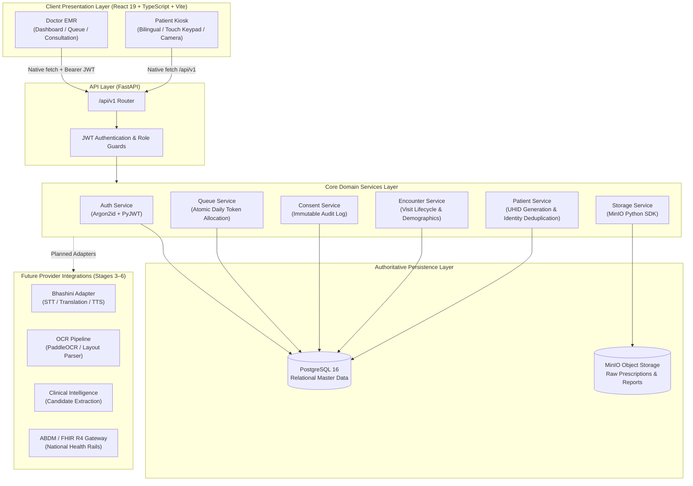

# MediKiosk

### AI-Powered Multilingual Patient Case-Taking, Document Digitization & Doctor EMR Platform

**Smart India Hackathon (SIH) 2026 — Problem Statement PS 26047: Patient Case-Taking Software**

---

> [!IMPORTANT]
> **Active Development Notice — SIH 2026**  
> MediKiosk is a proposed implementation for SIH Problem Statement 26047 (*Patient Case-Taking Software*). It is currently under active engineering development.  
> The repository combines a high-fidelity frontend kiosk and doctor EMR interface with an incrementally implemented, production-structured backend foundation.
> - **Stage 1 (Foundation):** Completed — FastAPI, PostgreSQL, SQLAlchemy 2.x, Alembic, MinIO storage abstraction, Docker Compose local infrastructure, and automated test suite.
> - **Stage 2 (Core Hospital Workflow):** Completed — Persistent patient master records, identity linking, encounter lifecycle, immutable consent tracking, PostgreSQL-backed daily OPD token allocation, doctor JWT authentication, route protection, and live queue polling.
> - **Future Stages (Stages 3–6):** Planned — Document OCR (PaddleOCR), multilingual voice transcription (Bhashini), clinical LLM assistance, and ABDM/FHIR R4 interoperability are planned extensions isolated behind pluggable provider interfaces.

---

## 1. Executive Summary

In high-volume public hospital Outpatient Departments (OPDs) across India, attending physicians routinely manage 80–120 patients in a single morning shift. This leaves approximately 2–3 minutes per consultation to elicit history, conduct physical examinations, review past paper records, determine diagnoses, counsel patients, and write prescriptions.

**MediKiosk** is designed to eliminate the clinical history-taking and documentation bottleneck at the hospital's first mile. Positioned in the OPD waiting area or registration hall, the platform enables patients—including elderly and low-literacy individuals—to independently provide their medical history through:
- Guided touch and visual navigation with large-format controls.
- Multilingual interaction in Indian languages (Hindi, Marathi, English).
- Structured clinical inquiry alongside specialized AYUSH health questionnaires.
- Paper document scanning for historical prescriptions, laboratory tests, and discharge summaries.
- Explicit, purpose-specific informed consent and patient-facing summary review.

Upon submission, the kiosk finalizes the visit record and atomically allocates an authoritative OPD token number. The case immediately appears on the attending physician's EMR queue via real-time backend synchronization. The doctor receives a structured, chronological summary before the patient enters the consultation room, preserving valuable face-to-face time for diagnostic assessment and compassionate care.

---

## 2. Problem Statement (PS 26047)

MediKiosk directly targets the challenges outlined in **SIH Problem Statement 26047 — *Patient Case-Taking Software***:

### Clinical History Bottleneck
High patient footfall forces physicians to rush history-taking. Critical clinical context—such as symptom onset, pain radiation, medication compliance, allergies, and lifestyle factors—is frequently under-elicited or omitted from case sheets, leading to diagnostic delays and repeated questioning.

### Fragmented Medical Records
Patients arrive at public clinics carrying crumpled paper prescriptions, unindexed diagnostic lab reports, and handwritten notes spanning months or years. Doctors lack the time to manually reconstruct chronological timelines from physical documents during a 3-minute visit.

### AYUSH Clinical Complexity
AYUSH (Ayurveda, Yoga & Naturopathy, Unani, Siddha, Homeopathy) clinical workflows require distinct evaluative dimensions beyond conventional allopathic intake, including *Prakriti* (constitution), *Vikriti* (imbalance), *Agni* (digestive fire), *Koshtha* (bowel habit), *Ahara-Vihara* (dietary-lifestyle regimen), *Nidana* (etiology), and *Samprapti* (pathogenesis). A modern intake system must support both general allopathic screening and AYUSH-specific structured inquiry.

### The First-Mile Digital Health Gap
While India's Ayushman Bharat Digital Mission (ABDM) establishes unified digital rails for health IDs (ABHA) and health record exchange, hospitals face a significant intake bottleneck at the point of physical arrival. MediKiosk bridges this physical-to-digital gap at the clinic doorstep.

---

## 3. Our Approach: The Clinical Verification Pipeline

A foundational clinical principle guides the architecture of MediKiosk:

> **AI, OCR, and automated intake algorithms must NEVER be treated as unverified clinical truth.**

Automated systems can misinterpret handwritten scrawls or regional idioms. MediKiosk enforces a strict, human-in-the-loop clinical pipeline:

```
  [Raw Evidence]
 (Patient voice, touch inputs, uploaded prescriptions, lab PDFs)
       │
       ▼
  [Processing Layer]
 (Transcription, OCR digitization, structured entity extraction)
       │
       ▼
  [Candidate Clinical Data]
 (Unverified proposals: preliminary complaints, suggested timeline, extracted meds)
       │
       ▼
  [Physician Verification]
 (Doctor reviews, edits, accepts, or rejects proposals in EMR)
       │
       ▼
  [Authoritative Clinical Record]
 (Signed consultation note stored in PostgreSQL & ready for ABDM/FHIR exchange)
```

The system acts as a cognitive assistant to the doctor—never as an autonomous diagnostic agent.

---

## 4. Key Capabilities

### 4.1 Patient Kiosk (`medikiosk-frontend`)
- **Multilingual Support:** Bilingual interface offering English, Hindi, and Marathi with synchronized regional typography and audio guidance cues.
- **Patient Identification:**
  - Fast-track ABHA lookup and demographic pre-filling.
  - Manual registration capturing name, age, gender, and mobile phone number with on-screen numeric touch keypad.
- **Informed Consent:** Explicit, multi-item consent disclosure explaining symptom review, voice capture, document scanning, and physician review before proceeding.
- **Demographic & Clinical Profile:** Chief complaint selection, duration, severity, and pain localization.
- **Voice & Touch Intake UI:** Dual-mode intake interface enabling patients to speak or tap responses to clinical questions.
- **AYUSH Assessment:** Specialized questionnaire covering constitutional habits, digestion, sleep, and lifestyle factors.
- **Medication & Allergy History:** Structured capture of active medicines, past drug reactions, and critical emergency symptoms.
- **Document Capture UI:** Guided camera-based scanner interface for capturing paper prescriptions, lab reports, and previous discharge summaries.
- **Submission & Token Generation:** Atomic backend submission generating a daily OPD token sequence and persistent hospital case code.

### 4.2 Doctor EMR (`medikiosk-frontend`)
- **Doctor Authentication:** Lightweight JWT-based login for medical officers, AYUSH physicians, and hospital administrators with role-based route guards.
- **OPD Queue Management:**
  - Real-time HTTP polling (4-second cadence) reflecting live kiosk submissions across separate browser sessions and devices.
  - Automatic emergency triage sorting placing critical safety alerts at the top of the queue.
  - Multi-parameter filtering by status (`Waiting`, `In Consultation`, `Completed`, `Attention Required`) and instant search across Token #, patient name, and complaint.
- **Doctor Dashboard:** Overview of daily OPD volume, active consultations, pending drafts, and system connectivity statuses.
- **Case Detail View:** Encounter-centric view displaying patient demographics, authoritative token number, intake timeline, safety alerts, and prior records.
- **Call Patient Action:** Atomic state transition changing queue entry to `CALLED` and clinical encounter to `IN_CONSULTATION`.
- **Consultation Interface:** Structured documentation area for clinical assessment, diagnosis, prescription items, follow-up instructions, and AYUSH *Prakriti* scoring.

---

## 5. System Architecture



---

## 6. Architecture Principles

1. **PostgreSQL as Sole Authoritative Source of Truth:**  
   All master entities—patients, identities, encounters, queue entries, consents, users, and hospital settings—are persisted in PostgreSQL. Browser memory is never treated as authoritative.
2. **Strict Entity Separation (`Patient ≠ Encounter ≠ Queue Entry`):**  
   - `Patient`: Long-lived master demographic identity with unique UHID.
   - `Encounter`: A distinct visit instance tied to a specific date and complaint.
   - `Queue Entry`: Transient OPD workflow state (Token #, `WAITING`, `CALLED`, `COMPLETED`) linked to an encounter.
3. **Pluggable Provider Abstraction:**  
   Storage, OCR, voice, and AI services are defined as abstract provider interfaces, ensuring that downstream model changes (e.g., swapping OCR engines or translation models) require zero modifications to core business services.
4. **Lean Infrastructure (No Redis / No Message Queues):**  
   Atomic daily token allocation is guaranteed via PostgreSQL row-level locks (`with_for_update`) on `hospital_settings`. Real-time queue updates utilize efficient client-side HTTP polling (3–5s), keeping the deployment self-hostable, low-cost, and resilient.
5. **Progressive Vertical Staging:**  
   Engineering follows a strict vertical slice discipline—infrastructure first, persistent workflow second, document processing third, voice fourth, intelligence fifth, and national interoperability sixth.

---

## 7. Technology Stack

### Current Implementation (Stages 1 & 2)

| Layer | Technology | Purpose | Status |
|---|---|---|---|
| **Frontend Framework** | React 19 + TypeScript | Touch-first kiosk UI and EMR interface | Implemented |
| **Frontend Tooling** | Vite 8 + Tailwind CSS v4 | Sub-second bundling and responsive utility styling | Implemented |
| **Frontend Routing** | React Router v7 | Multi-step kiosk workflow and protected doctor routes | Implemented |
| **State & Forms** | Context API + React Hook Form + Zod | Form validation, bilingual session state, and auth context | Implemented |
| **Backend Framework** | FastAPI 0.115+ (Python 3.11) | Async ASGI REST APIs and dependency injection | Implemented |
| **Database & ORM** | PostgreSQL 16 + SQLAlchemy 2.0 (asyncpg) | Relational persistence, constraints, and atomic transactions | Implemented |
| **Schema Migrations** | Alembic 1.14+ | Database revision history and DDL tracking | Implemented |
| **Authentication** | PyJWT + Argon2id (`argon2-cffi`) | Secure password hashing and stateless HS256 access tokens | Implemented |
| **Binary Object Storage** | MinIO Python SDK 7.2+ | S3-compatible medical document and audio storage foundation | Implemented |
| **Containerization** | Docker + Docker Compose | Self-contained PostgreSQL and MinIO development infrastructure | Implemented |
| **Testing** | Pytest + Pytest-Asyncio + aiosqlite + HTTPX | Automated unit, regression, and integration testing (35 tests) | Implemented |

### Planned Extensions (Stages 3–6)

| Capability | Target Technology | Purpose | Status |
|---|---|---|---|
| **Document OCR** | PaddleOCR / DocTR | Digitizing printed/handwritten prescriptions and lab tables | Planned (Stage 3) |
| **Voice & Indian Languages** | Bhashini APIs | Multilingual Speech-to-Text (STT) and regional audio TTS | Planned (Stage 4) |
| **Clinical Intelligence** | Open-source LLM / Gemini API | Candidate clinical history extraction and red-flag screening | Planned (Stage 5) |
| **National Interoperability** | ABDM Gateway + FHIR R4 | ABHA linking and standardized health document exchange | Planned (Stage 6) |

---

## 8. Repository Structure

```
MediKiosk/
├── README.md                            # Root project documentation (this file)
├── implementation_plan.md               # Technical implementation plans & stage milestones
│
├── medikiosk-backend/                   # FastAPI Backend Service
│   ├── Dockerfile                       # Production container definition
│   ├── docker-compose.yml               # Local infrastructure (PostgreSQL + MinIO)
│   ├── requirements.txt                 # Python runtime dependencies
│   ├── alembic.ini                      # Migration environment configuration
│   ├── .env.example                     # Reference environment variables
│   │
│   ├── alembic/                         # Alembic migration revisions
│   │   ├── env.py                       # Migration runner
│   │   └── versions/                    # Versioned schema migration files
│   │
│   ├── app/                             # Main application package
│   │   ├── main.py                      # FastAPI app entrypoint, CORS, and lifecycle
│   │   ├── core/                        # Configuration & security
│   │   │   ├── config.py                # Pydantic Settings management
│   │   │   └── security.py              # Argon2id hashing & JWT token operations
│   │   ├── db/                          # Database connection & seeding
│   │   │   ├── session.py               # Async engine and session factory
│   │   │   ├── base.py                  # Declarative base & metadata aggregation
│   │   │   └── seed.py                  # Idempotent development seed script
│   │   ├── models/                      # SQLAlchemy 2.0 ORM domain models
│   │   │   ├── user.py                  # Hospital staff & doctor accounts
│   │   │   ├── patient.py               # Master patient & identities (ABHA, Phone)
│   │   │   ├── encounter.py             # Hospital visit encounters
│   │   │   ├── queue.py                 # OPD queue entries & status
│   │   │   ├── consent.py               # History-preserving consent records
│   │   │   └── hospital.py              # Hospital settings & daily token sequence
│   │   ├── schemas/                     # Pydantic validation and serialization models
│   │   │   ├── auth.py                  # Login request & token schemas
│   │   │   ├── patient.py               # Patient CRUD schemas
│   │   │   ├── encounter.py             # Visit & detail schemas
│   │   │   ├── consent.py               # Consent capture schemas
│   │   │   └── queue.py                 # Queue item & call transition schemas
│   │   ├── services/                    # Core business logic layer
│   │   │   ├── auth/                    # Doctor auth & RBAC validation
│   │   │   ├── patient/                 # UHID generation & identity resolution
│   │   │   ├── encounter/               # Visit creation, updates, and completion
│   │   │   ├── consent/                 # Immutable consent recording
│   │   │   └── queue/                   # Atomic token allocation & state transitions
│   │   ├── providers/                   # External integration adapters
│   │   │   └── storage/                 # MinIO / S3 object storage provider
│   │   └── api/                         # REST API route handlers
│   │       └── v1/                      # Version 1 API routers (auth, patients, encounters, queue)
│   │
│   └── tests/                           # Automated Pytest suite (35 passing tests)
│       ├── conftest.py                  # In-memory test database & client fixtures
│       ├── test_stage2_api.py           # End-to-end integration & Stage 2 API tests
│       ├── test_db_models.py            # Model constraint & relationship tests
│       ├── test_health.py               # Liveness & readiness probe tests
│       ├── test_storage.py              # MinIO storage service tests
│       └── test_config.py               # Configuration parsing tests
│
└── medikiosk-frontend/                  # React 19 Frontend Application
    ├── package.json                     # Node.js dependencies and scripts
    ├── vite.config.ts                   # Vite bundler configuration
    ├── index.html                       # HTML document template
    ├── public/                          # Static assets and icons
    │
    └── src/                             # Application source code
        ├── App.tsx                      # Root component, router setup, and context providers
        ├── components/                  # Reusable UI components
        │   ├── kiosk/                   # Touch keypad, audio banners, step indicators
        │   ├── layout/                  # EMR layout, TopBar, and KioskBottomBar
        │   └── ui/                      # Bilingual text, badges, cards, modals
        ├── features/                    # Core state management
        │   ├── auth/                    # DoctorAuthContext (JWT & login state)
        │   └── patient/                 # PatientSessionContext (kiosk intake state)
        ├── services/                    # API client and service providers
        │   ├── api/                     # Native fetch API client (client.ts)
        │   ├── auth/                    # DoctorAuthProvider (token & session manager)
        │   ├── doctor/                  # Doctor case providers (mock & view models)
        │   └── submission/              # Kiosk submission adapters
        └── pages/                       # Application route views
            ├── patient/                 # Patient Kiosk flow (Identify, Abha, Register, Consent, Profile, Complaint, Voice, AYUSH, Documents, Review, Submit, Complete)
            └── doctor/                  # Doctor EMR flow (Login, Dashboard, DoctorQueue, CaseDetail, Consultation, Summary)
```

---

## 9. Core Data Model

```
 ┌──────────────┐          ┌───────────────────────┐
 │    User      │          │   HospitalSettings    │
 ├──────────────┤          ├───────────────────────┤
 │ id (UUID)    │          │ id (PK = 1)           │
 │ username     │          │ daily_token_seq (INT) │
 │ password_hash│          │ last_token_date (DATE)│
 │ role (ENUM)  │          └───────────────────────┘
 └──────────────┘
        
 ┌──────────────────────┐        1:N        ┌─────────────────────────┐
 │       Patient        │──────────────────<│    PatientIdentity      │
 ├──────────────────────┤                   ├─────────────────────────┤
 │ id (UUID, PK)        │                   │ id (UUID, PK)           │
 │ patient_uhid (UNIQUE)│                   │ patient_id (FK)         │
 │ full_name            │                   │ identity_type (ENUM)    │
 │ age, gender          │                   │ identity_value (UNIQUE) │
 └──────────────────────┘                   └─────────────────────────┘
            │ 1:N
            ▼
 ┌──────────────────────┐        1:N        ┌─────────────────────────┐
 │      Encounter       │──────────────────<│      ConsentRecord      │
 ├──────────────────────┤                   ├─────────────────────────┤
 │ id (UUID, PK)        │                   │ id (UUID, PK)           │
 │ encounter_number     │                   │ encounter_id (FK)       │
 │ patient_id (FK)      │                   │ accepted (BOOLEAN)      │
 │ status (ENUM)        │                   │ recorded_at (TIMESTAMP) │
 │ priority (ENUM)      │                   └─────────────────────────┘
 │ chief_complaint      │        1:N        ┌─────────────────────────┐
 └──────────────────────┘──────────────────<│       QueueEntry        │
                                            ├─────────────────────────┤
                                            │ id (UUID, PK)           │
                                            │ encounter_id (FK)       │
                                            │ token_number (INT)      │
                                            │ queue_status (ENUM)     │
                                            │ queued_at, called_at    │
                                            └─────────────────────────┘
```

- **`patients`**: Master demographic record. The UHID (`UHID-YYYYMMDD-XXXX`) is generated authoritatively by the backend.
- **`patient_identities`**: Decoupled multi-identity support allowing one patient to link both an ABHA ID and a mobile phone number without schema duplication.
- **`encounters`**: Tracks a specific clinical OPD visit. Maintains status (`WAITING`, `IN_CONSULTATION`, `COMPLETED`, `CLOSED`) and triage priority (`NORMAL`, `URGENT`, `EMERGENCY`).
- **`consent_records`**: Append-only, history-preserving consent records linking the patient, visit, acceptance state, and authoritative timestamp.
- **`queue_entries`**: OPD daily queue state tracking token allocation, queued timestamp, calling timestamp, and status (`WAITING`, `CALLED`, `IN_CONSULTATION`, `COMPLETED`).
- **`hospital_settings`**: Stores single-row settings (`id=1`) holding the daily token sequence counter, locked during token generation.

---

## 10. Current Implementation Status

| Capability / Area | Status | Verification & Notes |
|---|---|---|
| **Patient Kiosk UI** | Completed Prototype | High-fidelity 12-screen bilingual workflow (Hindi, Marathi, English) |
| **Doctor EMR UI** | Completed Prototype | Comprehensive dashboard, live queue, case detail, and consultation forms |
| **FastAPI Backend Framework** | **DONE (Stage 1)** | Core router, async session handling, lifecycle events, Pydantic validation |
| **PostgreSQL Schema Foundation** | **DONE (Stage 1)** | 7 core tables, foreign keys, unique constraints, and indexes |
| **Alembic Migrations** | **DONE (Stage 1)** | Automated schema migrations verified against PostgreSQL 16 |
| **MinIO Storage Provider** | **DONE (Stage 1)** | Object storage adapter, health checks, bucket provisioning, and presigned URLs |
| **Local Docker Infrastructure** | **DONE (Stage 1)** | Docker Compose running PostgreSQL (host port 5433) and MinIO (ports 9000–9001) |
| **Patient Master Persistence** | **DONE (Stage 2)** | Transactional creation, UHID generation, and identity deduplication |
| **Multi-Identity Search** | **DONE (Stage 2)** | Lookup by UHID, ABHA, or Mobile phone number |
| **Encounter Lifecycle** | **DONE (Stage 2)** | Visit creation, code generation, chief complaint patch, and completion |
| **Informed Consent Persistence** | **DONE (Stage 2)** | History-preserving consent records tied to encounters |
| **Atomic OPD Token Allocation** | **DONE (Stage 2)** | Row-locked daily token generation preventing concurrent duplicate tokens |
| **Doctor JWT Authentication** | **DONE (Stage 2)** | Argon2id password verification, HS256 JWT tokens, and role-based guards |
| **EMR Route Protection** | **DONE (Stage 2)** | Unauthenticated requests to `/doctor/*` redirect to `/doctor/login` |
| **Live Doctor Queue & Polling** | **DONE (Stage 2)** | Real-time queue populated from PostgreSQL with 4-second client polling |
| **Decoupled Kiosk ↔ Doctor Flow**| **DONE (Stage 2)** | In-memory bridge removed; kiosk and doctor run in separate sessions/devices |
| **Document OCR Pipeline** | Planned (Stage 3) | Prescriptions and lab reports currently use prototype document capture UI |
| **Multilingual Voice Intake** | Planned (Stage 4) | Audio capture UI present; Bhashini STT adapter planned for Stage 4 |
| **Clinical Intelligence (LLM)** | Planned (Stage 5) | Safety alerts currently rule-based; AI candidate extraction planned for Stage 5 |
| **ABDM / FHIR R4 Interoperability**| Planned (Stage 6) | ABHA format validated; live ABDM sandbox integration planned for Stage 6 |

---

## 11. Current Prototype vs Target System

| Architectural Dimension | Current Implementation (Stages 1 & 2) | Full Target Vision (Stages 3–6) |
|---|---|---|
| **Patient Registration** | Real PostgreSQL creation via REST API | Integrated with live ABDM M1/M2/M3 registration |
| **Identity Verification** | Phone and simulated ABHA verification | Live Aadhaar OTP / ABHA biometric verification |
| **Queue Synchronization** | PostgreSQL-backed HTTP polling (4s cadence) | Adaptive polling with push notifications |
| **Document Processing** | Camera capture UI with sample mock previews | MinIO storage + PaddleOCR digitized clinical tables |
| **Voice Processing** | Dual-mode voice UI with simulated audio response | Live Bhashini ASR streaming in 12+ Indian languages |
| **Clinical Extraction** | Rule-based triage and structured questionnaire | LLM clinical entity extraction & candidate generation |
| **Consultation Record** | Persistent encounter status & mock clinical state | Full clinical documentation database with FHIR R4 export |
| **Clinical Authority** | Doctor approves and starts consultation in EMR | Full physician verification and ABDM health data push |

---

## 12. Development Roadmap

### Stage 1 — Backend & Database Foundation `[COMPLETED]`
- [x] Establish modular FastAPI structure (`core`, `db`, `models`, `schemas`, `services`, `providers`).
- [x] Configure PostgreSQL with SQLAlchemy 2.0 async engine and Alembic migrations.
- [x] Create core domain models (`users`, `patients`, `patient_identities`, `encounters`, `consent_records`, `queue_entries`, `hospital_settings`).
- [x] Implement MinIO S3 object storage provider with connectivity health probes.
- [x] Configure Docker Compose for local development infrastructure.
- [x] Establish automated test suite with in-memory SQLite and mock storage (35 tests passing).

### Stage 2 — Core Hospital Workflow & Persistent Queue `[COMPLETED]`
- [x] Implement transactional Patient creation with server-generated UHID.
- [x] Implement patient lookup by identity (`UHID`, `ABHA`, `PHONE`).
- [x] Implement Encounter lifecycle APIs with server-generated encounter codes.
- [x] Implement append-only Consent persistence linked to encounters.
- [x] Implement atomic daily OPD token allocation using PostgreSQL row locking.
- [x] Implement Argon2id password hashing and HS256 JWT doctor authentication.
- [x] Implement role-based authorization for doctor endpoints (`DOCTOR`, `AYUSH_DOCTOR`).
- [x] Connect frontend Kiosk registration and submission to live backend REST endpoints.
- [x] Remove in-memory session injection bridge (`MockDoctorCaseProvider.injectPatientSession`).
- [x] Implement doctor EMR route protection and authenticated TopBar display.
- [x] Implement persistent Doctor Queue with 4-second polling and atomic "Call Patient" transitions.

### Stage 3 — Medical Documents & OCR Pipeline `[PLANNED]`
- [ ] Binary document upload to MinIO via presigned URLs.
- [ ] Integration of PaddleOCR / DocTR for prescription text and lab table extraction.
- [ ] OCR confidence scoring and bounding box visualizer in Doctor EMR.
- [ ] Chronological document timeline reconstruction.

### Stage 4 — Multilingual Voice Intake (Bhashini) `[PLANNED]`
- [ ] Audio recording capture in Kiosk frontend.
- [ ] Integration with Bhashini Speech-to-Text (ASR) APIs for Hindi, Marathi, and English.
- [ ] Real-time speech transcript review and patient confirmation on touchscreen.
- [ ] Regional language Text-to-Speech (TTS) audio prompts for low-literacy patients.

### Stage 5 — Clinical Intelligence & Doctor Verification `[PLANNED]`
- [ ] LLM-assisted conversational history-taking adapting to patient responses.
- [ ] Automated generation of candidate clinical summaries (symptoms, duration, medications).
- [ ] Red-flag clinical safety screening (e.g., chest pain, respiratory distress).
- [ ] Interactive physician verification interface to accept/edit candidate data.

### Stage 6 — ABDM & FHIR R4 Interoperability `[PLANNED]`
- [ ] ABDM M1 (ABHA creation & verification) integration.
- [ ] ABDM M2 (Health information provider - HIP linking).
- [ ] Mapping consultation records to standard FHIR R4 clinical resources.
- [ ] ABDM M3 (Health information user - HIU consent manager exchange).

---

## 13. Security, Privacy & Clinical Safety

- **Server-Side Security:** Secrets, JWT encryption keys, and database credentials are managed exclusively via environment variables (`.env`) and Pydantic Settings.
- **Password Protection:** Doctor credentials are hashed using modern Argon2id with memory, time, and parallelism costs. Plaintext passwords are never stored or logged.
- **Stateless Authorization:** Doctor sessions use signed HS256 JWT tokens containing expiration timestamps and role declarations (`DOCTOR`, `AYUSH_DOCTOR`, `HOSPITAL_ADMIN`).
- **Controlled CORS:** API rejects wildcard origin requests with credentials, enforcing strict allowed origin lists.
- **Privacy by Design:** Patient identifiers (ABHA numbers, phone numbers) are masked in frontend presentation and excluded from backend terminal logs.
- **Clinical Verification Boundary:** Output from automated intake, OCR, and AI models is strictly designated as *candidate information* requiring affirmative physician verification before becoming part of the permanent medical record.

> [!NOTE]
> This repository represents an engineering prototype developed for hackathon evaluation and demonstration. Production hospital deployment requires formal security audits, HL7/FHIR compliance testing, and adherence to Digital Personal Data Protection (DPDP) Act requirements.

---

## 14. Local Development Setup

### 14.1 Prerequisites
- **Node.js:** v18.0+ or v20.0+ (npm v9+)
- **Python:** 3.11+
- **Docker Desktop:** Running with Docker Compose support
- **Git**

---

### 14.2 Running Backend Infrastructure (Docker Compose)

The backend relies on PostgreSQL 16 and MinIO running locally via Docker Compose.

```bash
cd medikiosk-backend

# Start PostgreSQL and MinIO containers
docker compose up -d

# Verify containers are healthy
docker compose ps
```

*Port Mapping Note:*  
- **PostgreSQL 16:** Mapped to host port `5433` (to prevent conflicts if port 5432 is already occupied by a local PostgreSQL installation).
- **MinIO S3 API:** Port `9000`
- **MinIO Web Console:** Port `9001` (User: `minioadmin`, Password: `minioadminpassword`)

---

### 14.3 Backend Setup (FastAPI)

```bash
cd medikiosk-backend

# 1. Create and activate a Python 3.11 virtual environment
python -m venv .venv

# Windows PowerShell:
.venv\Scripts\Activate.ps1

# Linux / macOS:
source .venv/bin/activate

# 2. Install runtime dependencies
pip install -r requirements.txt

# 3. Configure environment variables
# Copy .env.example to .env (verify POSTGRES_PORT is 5433)
cp .env.example .env

# 4. Run database migrations to establish schema
alembic upgrade head

# 5. Populate initial development seed (Creates hospital settings and default doctor dr.priya)
python -m app.db.seed

# 6. Start the FastAPI development server
uvicorn app.main:app --host 0.0.0.0 --port 8000 --reload
```

Interactive API documentation will be available at:
- **Swagger UI:** `http://localhost:8000/docs`
- **ReDoc:** `http://localhost:8000/redoc`
- **Liveness Probe:** `http://localhost:8000/health`
- **Readiness Probe:** `http://localhost:8000/health/ready`

---

### 14.4 Frontend Setup (React 19 + Vite)

In a separate terminal:

```bash
cd medikiosk-frontend

# 1. Install Node.js dependencies
npm install

# 2. Start the Vite development server
npm run dev
```

The frontend application will start at: `http://localhost:5173`

- **Patient Kiosk Entrypoint:** `http://localhost:5173/patient`
- **Doctor EMR Login:** `http://localhost:5173/doctor/login`  
  *(Development seed credentials: Username `dr.priya`, Password `DoctorPass123!`)*

---

## 15. Testing & Verification

The project includes an automated test suite verifying database models, constraints, Alembic migrations, storage adapters, authentication, and end-to-end API workflows.

### Running Backend Tests
Backend tests execute in-memory using `aiosqlite` and mock storage providers, requiring no active Docker containers:

```bash
cd medikiosk-backend
.venv\Scripts\pytest -v tests/
```

**Test Suite Coverage (35/35 passing):**
- **Authentication:** Login success, invalid password rejection, JWT validation, unauthenticated access rejection, role-based authorization guards.
- **Patient Management:** Transactional patient creation, UHID formatting, duplicate identity handling, lookup by ABHA/Phone/UHID.
- **Encounter Lifecycle:** Encounter creation, code generation, chief complaint mutation, and patient relationship validation.
- **Consent:** Immutable append-only consent recording and history preservation.
- **OPD Queue & Tokens:** Atomic daily token sequence allocation, duplicate submission idempotency, emergency priority triage ordering.
- **Doctor Queue Actions:** Atomic call patient transitions (`WAITING` → `CALLED`, encounter `IN_CONSULTATION`).
- **End-to-End Integration:** Full journey from Patient Creation → Encounter → Consent → Submission → Queue → Doctor Pickup → Consultation Start.
- **Storage & Infrastructure:** MinIO bucket creation, health checks, presigned URLs, and Alembic migration application.

### Running Frontend Verification
To verify TypeScript compilation and bundle packaging:

```bash
cd medikiosk-frontend
npm run build
```
*(Build completes with exit code 0 and zero TypeScript errors.)*

---

## 16. Intended Demo Journey (SIH 2026 Evaluation)

### Scenario A: Patient Self-Registration at Kiosk
1. **Welcome Screen:** Patient approaches the kiosk and chooses language (**Hindi / Marathi / English**).
2. **Identification:** Patient selects **New Patient** and enters name, age, gender, and mobile number using the large-format on-screen touch keypad (or clicks "Fast Demo Fill").
3. **Informed Consent:** Patient reviews 4 informational cards covering symptom collection, voice recording, document review, and attending doctor details, then taps **"I Understand & Give Consent"**.
4. **Chief Complaint:** Patient selects primary symptom (e.g., Joint Pain, Fever, Digestive Issues) and specifies duration.
5. **Intake Flow:** Patient completes symptom localization, specialized AYUSH health questions, medication history, and past allergies.
6. **Submission:** Patient reviews their summary and taps Submit. An animated 3-step progress sequence verifies records and sends the encounter to the hospital server.
7. **Completion Ticket:** Kiosk displays the authoritative backend **OPD Token Number (e.g., Token #1)** and **Encounter Number**, instructing the patient to proceed to OPD Waiting Area.

### Scenario B: Doctor EMR Workflow
1. **Login:** In a separate browser tab or device, Dr. Priya Sharma accesses `/doctor/login` and signs in.
2. **OPD Queue:** Doctor views the live queue. Without refreshing, the new patient registration submitted at the kiosk appears within 4 seconds via polling.
3. **Triage:** If the patient reported emergency symptoms, the case automatically surfaces at the top of the queue with a red attention badge.
4. **Case Review:** Doctor clicks the patient card to inspect the complete structured intake summary, chief complaint, and demographics.
5. **Start Consultation:** Doctor clicks **"Start Consultation"**. The backend atomically transitions the patient to `IN_CONSULTATION` and records the start timestamp.
6. **Consultation & Prescription:** Doctor reviews historical records, enters clinical diagnosis, prescribes medications, records AYUSH *Prakriti* observations, and finalizes the visit.

---

## 17. Project Roadmap Checklist

- [x] **Stage 1: Foundation**
  - [x] FastAPI application framework and configuration
  - [x] PostgreSQL database models & Alembic migration
  - [x] MinIO object storage foundation & health checks
  - [x] Local Docker Compose infrastructure
  - [x] Automated test framework (35 passing tests)
- [x] **Stage 2: Core Hospital Workflow**
  - [x] Transactional patient registration & UHID generation
  - [x] Multi-identity search (ABHA, Phone, UHID)
  - [x] Encounter visit lifecycle management
  - [x] History-preserving informed consent persistence
  - [x] PostgreSQL row-locked atomic daily token allocation
  - [x] Doctor Argon2id + JWT authentication & EMR route guards
  - [x] Real-time HTTP polling doctor queue
  - [x] Decoupled Kiosk ↔ Doctor persistent workflow
- [ ] **Stage 3: Medical Documents**
  - [ ] Binary document upload to MinIO S3 storage
  - [ ] OCR extraction pipeline (PaddleOCR)
  - [ ] Document confidence scoring & doctor review interface
- [ ] **Stage 4: Multilingual Voice**
  - [ ] Audio capture in Kiosk frontend
  - [ ] Bhashini STT pipeline integration
  - [ ] Regional TTS audio guidance
- [ ] **Stage 5: Clinical Intelligence**
  - [ ] Conversational LLM history intake
  - [ ] Structured candidate clinical summary extraction
  - [ ] Automated red-flag symptom screening
  - [ ] Doctor verification & edit workflow
- [ ] **Stage 6: Interoperability**
  - [ ] ABDM M1/M2/M3 sandbox gateway integration
  - [ ] FHIR R4 clinical document resource mapping
  - [ ] National Health Stack data exchange

---

## 18. Author

**Tejas Halvankar**  
*MediKiosk — Smart India Hackathon 2026*  
Backend architecture, database foundation, clinical workflows, and system implementation.

---

*Repository: [https://github.com/Tejas-H01/-Medikiosk.git](https://github.com/Tejas-H01/-Medikiosk.git)*
